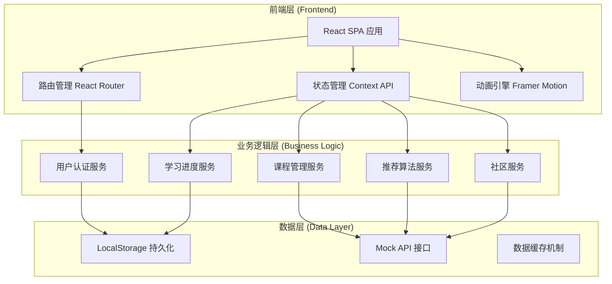
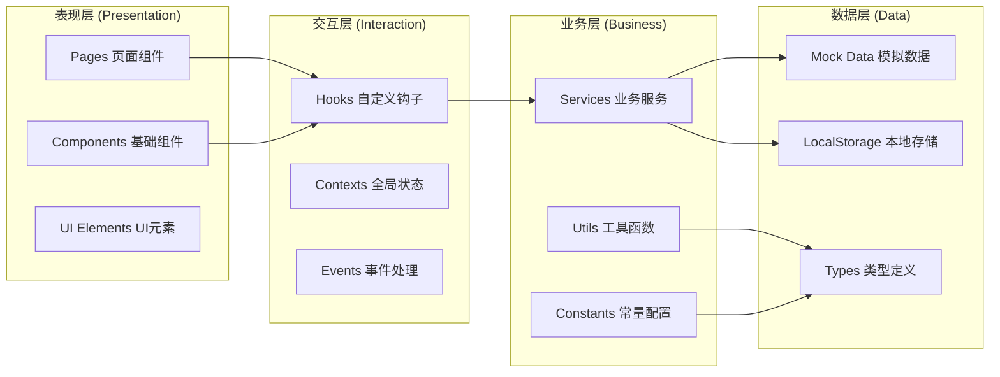
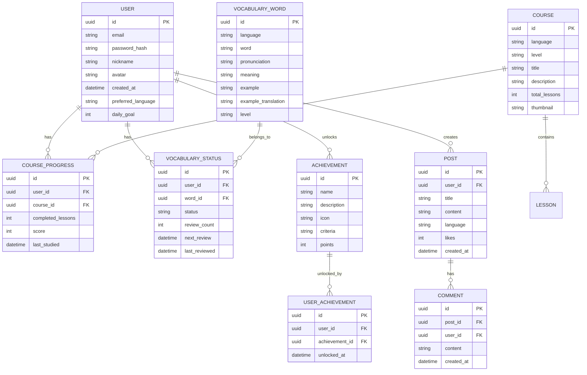

# 语言星球 - 技术架构文档

## 1. 系统架构设计

### 1.1 整体架构



### 1.2 前端架构分层



---

## 2. 技术栈详细说明

### 2.1 核心技术选型

| 技术类别 | 技术选型 | 版本 | 说明 |
|---------|---------|------|------|
| **核心框架** | React | 18.x | 函数式组件 + Hooks |
| **类型系统** | TypeScript | 5.x | 静态类型检查 |
| **构建工具** | Vite | 5.x | 快速热更新 |
| **路由管理** | React Router | 6.x | SPA路由控制 |
| **样式方案** | Tailwind CSS | 3.x | 原子化CSS |
| **动画引擎** | Framer Motion | 11.x | 声明式动画 |
| **图标库** | Lucide React | 最新 | 现代化图标 |
| **状态管理** | Context API | 内置 | 全局状态共享 |

### 2.2 项目初始化命令

```bash
# 使用 Vite 创建 React + TypeScript 项目
npm create vite@latest language-planet -- --template react-ts

# 安装依赖
cd language-planet
npm install

# 安装额外依赖
npm install react-router-dom framer-motion lucide-react

# 安装 Tailwind CSS
npm install -D tailwindcss postcss autoprefixer
npx tailwindcss init -p
```

### 2.3 项目目录结构

```
language-planet/
├── public/
│   └── assets/
│       ├── images/          # 图片资源
│       └── audio/           # 音频资源
├── src/
│   ├── components/          # 可复用组件
│   │   ├── common/          # 通用组件（按钮、卡片等）
│   │   ├── layout/          # 布局组件（导航、页脚）
│   │   ├── learn/           # 学习模块组件
│   │   └── community/       # 社区组件
│   ├── pages/               # 页面组件
│   │   ├── Home/            # 首页
│   │   ├── Auth/            # 认证页（登录/注册）
│   │   ├── Learn/           # 学习中心
│   │   ├── Vocabulary/     # 单词记忆
│   │   ├── Grammar/         # 语法练习
│   │   ├── Speaking/        # 口语跟读
│   │   ├── Listening/       # 听力训练
│   │   ├── Progress/        # 进度追踪
│   │   ├── Community/       # 社区
│   │   └── Profile/         # 个人中心
│   ├── contexts/            # React Context
│   │   ├── AuthContext.tsx  # 认证状态
│   │   ├── LearnContext.tsx # 学习状态
│   │   └── ThemeContext.tsx # 主题状态
│   ├── hooks/               # 自定义 Hooks
│   │   ├── useAuth.ts       # 认证钩子
│   │   ├── useProgress.ts   # 进度钩子
│   │   └── useLearning.ts   # 学习钩子
│   ├── services/            # 业务服务层
│   │   ├── authService.ts   # 认证服务
│   │   ├── courseService.ts # 课程服务
│   │   └── progressService.ts# 进度服务
│   ├── data/                # Mock 数据
│   │   ├── courses.ts       # 课程数据
│   │   ├── vocabulary.ts    # 词汇数据
│   │   ├── grammar.ts       # 语法数据
│   │   └── users.ts         # 用户数据
│   ├── types/               # TypeScript 类型
│   │   ├── user.ts          # 用户类型
│   │   ├── course.ts        # 课程类型
│   │   └── progress.ts       # 进度类型
│   ├── utils/               # 工具函数
│   │   ├── storage.ts       # 存储工具
│   │   ├── helpers.ts       # 辅助函数
│   │   └── validators.ts    # 验证函数
│   ├── App.tsx              # 根组件
│   ├── main.tsx             # 入口文件
│   └── index.css            # 全局样式
├── .gitignore
├── package.json
├── tsconfig.json
├── vite.config.ts
├── tailwind.config.js
└── README.md
```

---

## 3. 路由定义

### 3.1 路由表

| 路由路径 | 页面名称 | 访问权限 | 说明 |
|---------|---------|---------|------|
| `/` | 首页 | 公开 | 语言选择、功能展示 |
| `/login` | 登录页 | 公开 | 用户登录 |
| `/register` | 注册页 | 公开 | 用户注册 |
| `/learn` | 学习中心 | 已登录 | 主学习界面 |
| `/vocabulary` | 单词记忆 | 已登录 | 词汇学习模块 |
| `/grammar` | 语法练习 | 已登录 | 语法学习模块 |
| `/speaking` | 口语跟读 | 已登录 | 口语训练模块 |
| `/listening` | 听力训练 | 已登录 | 听力训练模块 |
| `/progress` | 进度追踪 | 已登录 | 学习数据展示 |
| `/community` | 社区 | 已登录 | 社区交流 |
| `/profile` | 个人中心 | 已登录 | 用户设置 |
| `/settings` | 设置页 | 已登录 | 应用设置 |

### 3.2 路由守卫策略

```typescript
// 路由守卫逻辑
- 未登录用户访问需要权限的页面 → 重定向到 /login
- 已登录用户访问 /login 或 /register → 重定向到 /learn
- 所有路由都有加载状态显示
```

---

## 4. API 接口设计（Mock模式）

### 4.1 用户认证 API

```typescript
// 注册
POST /api/auth/register
Request: {
  email: string;
  password: string;
  nickname: string;
}
Response: {
  success: boolean;
  user: User;
  token: string;
}

// 登录
POST /api/auth/login
Request: {
  email: string;
  password: string;
}
Response: {
  success: boolean;
  user: User;
  token: string;
}

// 获取当前用户
GET /api/auth/me
Headers: { Authorization: Bearer <token> }
Response: {
  user: User;
}
```

### 4.2 课程 API

```typescript
// 获取课程列表
GET /api/courses?language=<language>&level=<level>
Response: {
  courses: Course[];
}

// 获取课程详情
GET /api/courses/:id
Response: {
  course: CourseDetail;
}

// 获取学习内容
GET /api/courses/:id/lessons
Response: {
  lessons: Lesson[];
}
```

### 4.3 词汇 API

```typescript
// 获取单词列表
GET /api/vocabulary?language=<language>&level=<level>
Response: {
  words: VocabularyWord[];
}

// 标记单词掌握状态
PUT /api/vocabulary/:id/status
Request: {
  status: 'new' | 'learning' | 'mastered';
}
Response: {
  success: boolean;
}
```

### 4.4 进度 API

```typescript
// 获取学习进度
GET /api/progress
Response: {
  totalStudyTime: number;
  streakDays: number;
  wordsLearned: number;
  grammarCompleted: number;
  speakingPractice: number;
  listeningPractice: number;
}

// 更新每日进度
POST /api/progress/daily
Request: {
  language: string;
  module: string;
  duration: number;
}
Response: {
  success: boolean;
  streakDays: number;
}
```

---

## 5. 数据模型设计

### 5.1 实体关系图



### 5.2 数据定义语言 (DDL)

```sql
-- 用户表
CREATE TABLE users (
    id TEXT PRIMARY KEY,
    email TEXT UNIQUE NOT NULL,
    password_hash TEXT NOT NULL,
    nickname TEXT NOT NULL,
    avatar TEXT,
    created_at DATETIME DEFAULT CURRENT_TIMESTAMP,
    preferred_language TEXT DEFAULT 'english',
    daily_goal INTEGER DEFAULT 10,
    total_points INTEGER DEFAULT 0,
    level INTEGER DEFAULT 1,
    streak_days INTEGER DEFAULT 0
);

-- 课程表
CREATE TABLE courses (
    id TEXT PRIMARY KEY,
    language TEXT NOT NULL,
    level TEXT NOT NULL,
    title TEXT NOT NULL,
    description TEXT,
    total_lessons INTEGER DEFAULT 10,
    thumbnail TEXT,
    order_index INTEGER DEFAULT 0
);

-- 课程进度表
CREATE TABLE course_progress (
    id TEXT PRIMARY KEY,
    user_id TEXT NOT NULL,
    course_id TEXT NOT NULL,
    completed_lessons INTEGER DEFAULT 0,
    score INTEGER DEFAULT 0,
    last_studied DATETIME,
    FOREIGN KEY (user_id) REFERENCES users(id),
    FOREIGN KEY (course_id) REFERENCES courses(id),
    UNIQUE(user_id, course_id)
);

-- 词汇表
CREATE TABLE vocabulary (
    id TEXT PRIMARY KEY,
    language TEXT NOT NULL,
    word TEXT NOT NULL,
    pronunciation TEXT,
    meaning TEXT NOT NULL,
    example TEXT,
    example_translation TEXT,
    level TEXT DEFAULT 'beginner'
);

-- 词汇掌握状态表
CREATE TABLE vocabulary_status (
    id TEXT PRIMARY KEY,
    user_id TEXT NOT NULL,
    word_id TEXT NOT NULL,
    status TEXT DEFAULT 'new',
    review_count INTEGER DEFAULT 0,
    next_review DATETIME,
    last_reviewed DATETIME,
    FOREIGN KEY (user_id) REFERENCES users(id),
    FOREIGN KEY (word_id) REFERENCES vocabulary(id),
    UNIQUE(user_id, word_id)
);

-- 成就表
CREATE TABLE achievements (
    id TEXT PRIMARY KEY,
    name TEXT NOT NULL,
    description TEXT,
    icon TEXT,
    criteria TEXT,
    points INTEGER DEFAULT 0
);

-- 用户成就表
CREATE TABLE user_achievements (
    id TEXT PRIMARY KEY,
    user_id TEXT NOT NULL,
    achievement_id TEXT NOT NULL,
    unlocked_at DATETIME DEFAULT CURRENT_TIMESTAMP,
    FOREIGN KEY (user_id) REFERENCES users(id),
    FOREIGN KEY (achievement_id) REFERENCES achievements(id),
    UNIQUE(user_id, achievement_id)
);

-- 帖子表
CREATE TABLE posts (
    id TEXT PRIMARY KEY,
    user_id TEXT NOT NULL,
    title TEXT NOT NULL,
    content TEXT NOT NULL,
    language TEXT,
    likes INTEGER DEFAULT 0,
    created_at DATETIME DEFAULT CURRENT_TIMESTAMP,
    FOREIGN KEY (user_id) REFERENCES users(id)
);

-- 评论表
CREATE TABLE comments (
    id TEXT PRIMARY KEY,
    post_id TEXT NOT NULL,
    user_id TEXT NOT NULL,
    content TEXT NOT NULL,
    created_at DATETIME DEFAULT CURRENT_TIMESTAMP,
    FOREIGN KEY (post_id) REFERENCES posts(id),
    FOREIGN KEY (user_id) REFERENCES users(id)
);

-- 学习记录表
CREATE TABLE study_records (
    id TEXT PRIMARY KEY,
    user_id TEXT NOT NULL,
    module TEXT NOT NULL,
    language TEXT NOT NULL,
    duration INTEGER NOT NULL,
    date DATE NOT NULL,
    FOREIGN KEY (user_id) REFERENCES users(id)
);
```

---

## 6. 状态管理设计

### 6.1 AuthContext 认证状态

```typescript
interface AuthState {
  user: User | null;
  isAuthenticated: boolean;
  isLoading: boolean;
}

interface AuthContextType {
  state: AuthState;
  login: (email: string, password: string) => Promise<void>;
  register: (email: string, password: string, nickname: string) => Promise<void>;
  logout: () => void;
  updateProfile: (data: Partial<User>) => Promise<void>;
}
```

### 6.2 LearnContext 学习状态

```typescript
interface LearnState {
  currentLanguage: string;
  currentCourse: Course | null;
  currentLesson: Lesson | null;
  dailyProgress: {
    wordsLearned: number;
    grammarCompleted: number;
    speakingMinutes: number;
    listeningMinutes: number;
  };
}

interface LearnContextType {
  state: LearnState;
  setCurrentLanguage: (lang: string) => void;
  startLesson: (lessonId: string) => void;
  completeLesson: (lessonId: string, score: number) => Promise<void>;
  updateDailyProgress: (module: string, delta: number) => void;
}
```

### 6.3 ProgressContext 进度状态

```typescript
interface ProgressState {
  totalStudyTime: number;
  streakDays: number;
  achievements: Achievement[];
  weeklyData: number[];
  skills: {
    vocabulary: number;
    grammar: number;
    speaking: number;
    listening: number;
  };
}

interface ProgressContextType {
  state: ProgressState;
  fetchProgress: () => Promise<void>;
  checkAchievements: () => Promise<void>;
  getWeeklyStats: () => number[];
}
```

---

## 7. 本地存储策略

### 7.1 LocalStorage 键值设计

```typescript
// 用户认证
const AUTH_TOKEN = 'language_planet_token';
const USER_DATA = 'language_planet_user';

// 学习进度
const PROGRESS_DATA = 'language_planet_progress';
const DAILY_GOAL = 'language_planet_daily_goal';

// 设置偏好
const SETTINGS = 'language_planet_settings';
const PREFERRED_LANGUAGE = 'language_planet_language';

// 学习记录
const STUDY_HISTORY = 'language_planet_study_history';
const VOCABULARY_STATUS = 'language_planet_vocab_status';
const BOOKMARKS = 'language_planet_bookmarks';
```

### 7.2 数据同步策略

```typescript
// 自动保存策略
- 用户每次完成学习模块后，自动保存进度
- 页面切换时检查并保存未保存的数据
- 应用启动时从 LocalStorage 恢复用户状态
- 设置防抖机制，避免频繁写入（500ms）
```

---

## 8. 性能优化策略

### 8.1 首屏加载优化

```typescript
// 优化措施
- React.lazy() + Suspense 实现路由级代码分割
- 图片懒加载（loading="lazy"）
- 预加载关键资源（<link rel="preload">）
- Tailwind CSS 按需编译
- Vite 打包优化（terser、splitChunks）
```

### 8.2 运行时性能

```typescript
// React 性能优化
- 使用 useMemo 和 useCallback 减少不必要的渲染
- React.memo 包装纯展示组件
- 虚拟列表优化长列表渲染
- 动画使用 will-change 和 transform
- 事件处理函数防抖和节流
```

### 8.3 缓存策略

```typescript
// 缓存方案
- API 响应缓存（sessionStorage）
- 静态资源长期缓存（1年）
- 学习数据变更后局部更新
- 使用 SWR 或 React Query 模式（可自行实现）
```

---

## 9. 安全考虑

### 9.1 前端安全

```typescript
// 安全措施
- XSS 防护：React 自动转义 HTML
- CSRF：使用 token 验证
- 敏感数据：使用 HttpOnly Cookie（后端配合）
- 本地存储：避免存储敏感信息
```

### 9.2 密码安全

```typescript
// 密码要求
- 最少 8 位字符
- 包含大小写字母
- 包含数字
- 使用 bcrypt 加密存储（后端）
```

---

## 10. 可访问性 (A11y)

### 10.1 WCAG 2.1 合规

```typescript
// 无障碍要求
- 所有图片有 alt 属性
- 键盘可访问（Tab、Enter、Esc）
- 颜色对比度符合 AA 标准
- 表单标签和错误提示
- ARIA 属性标记
- 焦点状态清晰可见
```

---

**文档版本**：v1.0
**创建日期**：2026-05-15
**技术负责人**：AI Development Team
